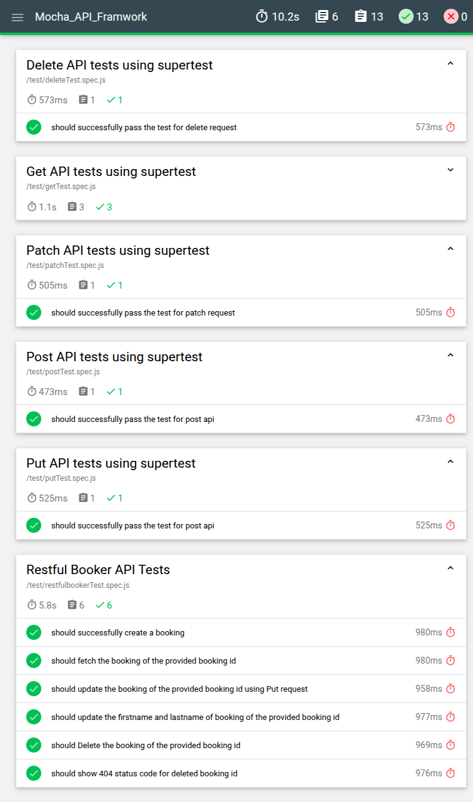

Mocha API Framework
==========================================

Overview
--------

This repository contains a robust API testing framework designed for dynamic data generation, CRUD operations, reporting, linting, containerization, and CI/CD integration. It ensures high test coverage, readability, and maintainability while leveraging industry-best practices.

Features
--------

### 1\. **Dynamic Data Generation**

*   **Library Used**: [Faker.js](https://fakerjs.dev/)
    
*   Faker.js is used to dynamically generate test data, ensuring realistic and diverse test cases.
    

### 2\. **CRUD Operations**

The framework supports all CRUD operations:

*   **POST**: Create resources.
    
*   **GET**: Fetch resources.
    
*   **PUT**: Update resources entirely.
    
*   **PATCH**: Update resources partially.
    
*   **DELETE**: Remove resources.
    

### 3\. **Reporting**

*   **Library Used**: [Mochawesome](https://www.npmjs.com/package/mochawesome)
    
*   Generates detailed and visually appealing test execution reports.
    
*   Reports include test summaries, errors, and execution time.

    

### 4\. **Linting**

*   **Tool Used**: ESLint
    
*   Ensures clean, consistent, and error-free code.
    
*   Commands:
    
        npm run lint
        
### 5\. **Containerization**

*   **Tool Used**: Docker
    
*   A Dockerfile is included to containerize the framework for consistent testing environments.
    

### 6\. **CI/CD Integration**

*   Automated CI/CD pipeline runs on every push and pull request.
    
*   Includes steps for:
    
    *   Code linting.
        
    *   Running test cases.
        
    *   Generating reports.
        
    *   Docker container build and deployment.
        

Setup Instructions
------------------

### Prerequisites

*   Node.js (v14 or later)
    
*   Docker (if containerization is required)
    
*   Please refer .env.template file

### Installation

1.  git clone cd
    
2.  npm install
    
3.  Set up environment variables by creating a .env file in the root directory.
    

Usage
-----

### Running Tests

    npm test
    

### Generate Reports

    npm test
    

### Lint Code

    npm run lint
    
    npm run build
    

### Docker

    docker build -t mocha_api_framework .
    
    docker run -d mocha_api_framework
    

### CI/CD Pipeline

*   On every push or pull request, the pipeline:
    
    *   Lints the code.
        
    *   Executes test cases.
        
    *   Builds the Docker image.
        
    *   Deploys the container (if applicable).
        

Framework Structure
-------------------

    └── amaninreal-javascript_mocha_api/
        ├── README.md
        ├── Dockerfile
        ├── eslint.config.mjs
        ├── global.js
        ├── package.json
        ├── .env.template
        ├── .eslintrc.json
        ├── assets/
        ├── test/
        │   ├── deleteTest.spec.js
        │   ├── getTest.spec.js
        │   ├── patchTest.spec.js
        │   ├── postTest.spec.js
        │   ├── putTest.spec.js
        │   └── restfulbookerTest.spec.js
        ├── utils/
        │   └── apiClient.js
        └── .github/
            └── workflows/
                └── api.yaml

CRUD Operations Covered
-----------------------

*   **Booking Creation** (POST)
    
*   **Fetch Booking** (GET)
    
*   **Update Booking** (PUT and PATCH)
    
*   **Delete Booking** (DELETE)
    

### Example Test Highlights:

1.  Authentication using /auth endpoint.
    
2.  Dynamic test data generation with Faker.js.
    
3.  Assertions for status codes, response bodies, and headers.
    

Contributing
------------

1.  Fork the repository.
    
2.  git checkout -b feature-branch-name
    
3.  git commit -m "Describe your changes"
    
4.  git push origin feature-branch-name
    
5.  Create a pull request.
    

License
-------

This project is licensed under the MIT License. See the LICENSE file for details.

Contact
-------

For issues or questions, feel free to raise an issue in the repository or contact the maintainer.